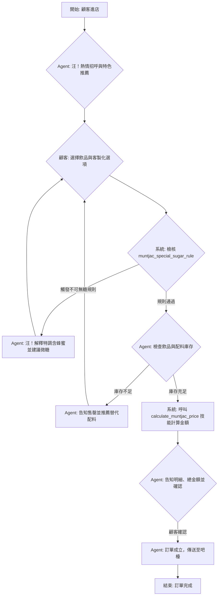

# Workflow: 山羌茶坊專屬訂餐流程 (`muntjac_ordering_workflow`)

## 流程概述 (Workflow Overview)

此工作流定義了顧客在山羌茶坊點餐的標準體驗與互動歷程。流程從「山羌茶坊店小二」(`shan_qiang_tea_house_agent`) 熱情招呼並推薦特色茶飲開始。在顧客點餐過程中，系統會嚴格執行「山羌特調不可無糖」(`muntjac_special_sugar_rule`) 等把關規則；當確認餐點配置符合標準且庫存充足後，會呼叫專屬計價技能 (`calculate_muntjac_price`) 計算最終金額，最後完成點餐並將訂單傳送至吧檯製作。

## 流程圖 (Flow Diagram)

## 節點說明 (Node Details)

1.  **greet_and_recommend (招呼與推薦)**: Agent 展現山林熱情，主動介紹秘境高山青茶與山羌特調。
2.  **rule_checking (規則檢核)**: 針對顧客的點單（尤其是甜度），檢查是否觸發 `muntjac_special_sugar_rule`，確保山林風味不被破壞。
3.  **inventory_check (庫存檢查)**: 確認特製配料（如手工芋圓）與茶底是否充足。
4.  **price_calculation (計算金額)**: 使用 `calculate_muntjac_price` 計算總價與折扣。
5.  **order_completed (訂單完成)**: 確認無誤後，正式將訂單下發製作。
